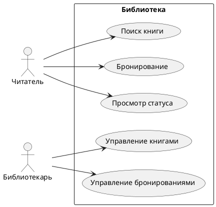
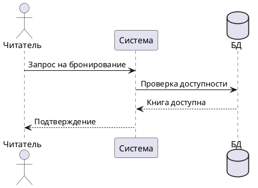

# PlantUML — диаграммы из кода

## Что такое PlantUML
PlantUML — инструмент, который генерирует диаграммы из текстового описания (кода).

## Преимущества
- Диаграммы хранятся в репозитории как обычный текст
- Легко править (VS Code, любой текстовый редактор)
- Интеграция с CI/CD (автогенерация при коммите)
- Поддержка диаграмм: Use Case, Sequence, Class, ER, BPMN

## Пример: Use Case диаграмма (PlantUML)

## Пример: Диаграмма последовательности

## Где использовать
- VS Code — плагин PlantUML
- Онлайн-редактор: plantuml.com
- Confluence — макрос PlantUML

---
*Источник: лекция «Инструменты системного аналитика»*
